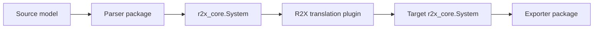

# Architecture

R2X is the translation layer in the broader r2x model-interoperability
workflow. Each stage has a focused responsibility:

## Package boundaries

| Layer | Responsibility | Examples |
| --- | --- | --- |
| CLI | Discovers plugins, manages the Python environment, and runs pipelines. | [`r2x-cli`](https://github.com/NatLabRockies/r2x-cli) |
| Parser | Reads a source format into an `r2x_core.System`. | [`r2x-reeds`](https://github.com/NatLabRockies/r2x-reeds), [`r2x-plexos`](https://github.com/NatLabRockies/r2x-plexos), [`r2x-sienna`](https://github.com/NatLabRockies/r2x-sienna) |
| Core | Provides the shared `System`, `PluginContext`, `Rule`, and rule-engine APIs. | [`r2x-core`](https://github.com/NatLabRockies/r2x-core) |
| Interoperability | Maps source components and fields to target components and attaches derived data. | This repository |
| Exporter | Writes a target system to its native format. | [`r2x-plexos`](https://github.com/NatLabRockies/r2x-plexos), [`r2x-sienna`](https://github.com/NatLabRockies/r2x-sienna) |

## Interoperability package structure

Each package under `packages/` has a related shape, with package-specific differences:

- `translation.py` exposes the public interoperability function.
- `plugin_config.py` defines the typed configuration accepted by that function.
- `config/` contains package configuration artifacts. Depending on the package,
  this includes `defaults.json`, `translation_rules.json`, `parser_rules.json`,
  `exporter_rules.json`, `file_mapping.json`, or package-specific `rules.json`
  and configuration helpers. `r2x_core.PluginConfig` exposes paths to these
  assets, including `translation_rules_path`.
- Getter and post-processing modules contain derived-field and integration logic.
  Their names are package-specific, such as `getters.py`, `getter_utils.py`,
  `getters_utils.py`, or `getters_mappings.py`.
- `tests/` exercises translation behavior and important edge cases.

For the shared configuration and plugin conventions, see the
[`r2x-core` plugin-system documentation](https://natlabrockies.github.io/r2x-core/explanations/plugin-system/)
and [`r2x-core` rules documentation](https://natlabrockies.github.io/r2x-core/explanations/rules-system/).

For example, `r2x-reeds-to-plexos` exposes
`reeds_to_plexos(system, config)`. It loads its rules, creates the target PLEXOS
system, applies the mappings, and then attaches reserve, generator, region-load,
and purchaser time series. The other packages follow the same public-function
pattern while their configuration artifacts and post-processing modules differ.

## Rules and getters

Rules handle direct field mappings, defaults, source and target component types,
and filters. Interoperability packages commonly load their declarative mapping
records from `config/translation_rules.json` through
`config.translation_rules_path`; packages with separate parser or exporter
contracts may use the corresponding `parser_rules.json`, `exporter_rules.json`,
or package-specific `rules.json`. Getter functions handle values that require
computation or context, such as unit conversion, commitment status, outage rates,
memberships, and name resolution. Supplemental attributes and post-processing
helpers handle relationships and data that cannot be represented by a simple
field mapping. Keep these responsibilities separate: put stable mapping records
in the appropriate JSON asset, put computed values in a getter, and use the
package's post-processing helpers for integration-specific work.

When a mapping changes, update the rule and the behavior-focused tests together.
When a getter changes, test both its returned value and the resulting target
component or time series where feasible.
