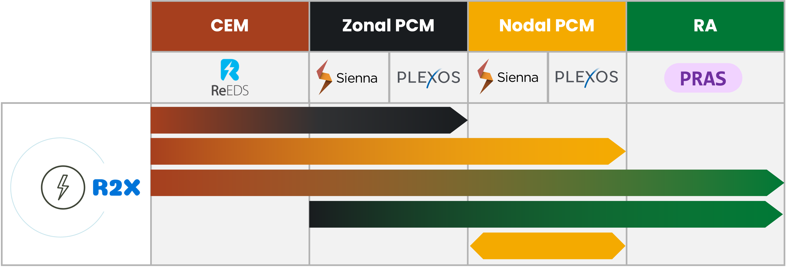

# Welcome to R2X's documentation!

R2X is a translating framework for inputs/outputs of power system model to “X” model(s).


## Model coverage




## Roadmap

If you're curious about what we're working on, check out the roadmap:

- [Active issues](https://github.com/NREL/R2X/issues?q=is%3Aopen+is%3Aissue+label%3A%22Working+on+it+%F0%9F%92%AA%22+sort%3Aupdated-asc): Issues that we are actively working on.
- [Prioritized backlog](https://github.com/NREL/R2X/issues?q=is%3Aopen+is%3Aissue+label%3ABacklog): Issues we'll be working on next.
- [Nice-to-have](https://github.com/NREL/R2X/labels/Optional): Nice to have features or Issues to fix. Anyone can start working on (please let us know before you do).
- [Ideas](https://github.com/NREL/R2X/issues?q=is%3Aopen+is%3Aissue+label%3AIdea): Future work or ideas for R2X.


## List of parsers

```{eval-rst}
.. autosummary::
   :nosignatures:

   ~r2x.parser.reeds.ReEDSParser
   ~r2x.parser.plexos.PlexosParser
```

## List of exporters

```{eval-rst}
.. autosummary::
   :nosignatures:

   ~r2x.exporter.plexos.PlexosExporter
   ~r2x.exporter.sienna.SiennaExporter
```

## Model compatibility

| R2X Version  | Supported Input Model Versions           | Supported Output Model Versions          |
|--------------|----------------------------------------- |----------------------------------------- |
|     1.0      | ReEDS (v2024.8.0)                        | PLEXOS (9.0, 9.2, 10)                    |
|              | Sienna (PSY 3.0)                         | Sienna (PSY 3.0, 4.0)                    |
|              | PLEXOS (9.0, 9.2, 10)                    |                                          |


```{toctree}
:hidden: true
install.md
usage.md
howtos.md
CHANGELOG.md
troubleshoot.md
```

```{toctree}
:caption: Developer Guide
:hidden: true

dev/develop.md
dev/git.md
```

```{toctree}
:caption: Modeling PCM
:hidden: true

model/logic.md
model/diagram.md
model/models.md
model/data_models.md
model/terminology.md
```


```{toctree}
:caption: Zonal to Nodal
:hidden: true

nodal.md
```

```{toctree}
:caption: Plexos Utils
:hidden: true

dev/plexosdb.md
```

```{toctree}
:caption: API Documentation
:hidden: true

api/enums.md
api/config.md
api/system.md
api/plexos.md
api/models.md
api/parsers.md
api/exporters.md
```
